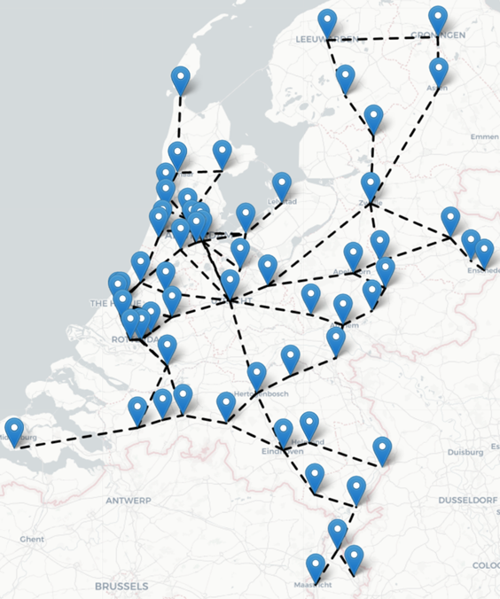

# TeamEctrie

## Beschrijving

Het vinden van een efficiënte spoorlijnindeling is cruciaal voor het treinverkeer in Nederland. Het is een complexe uitdaging die opgelost kan worden met behulp van AI-technologieën. Een spoorlijnindeling bestaat uit verschillende trajecten waarlangs treinen zich gedurende de dag verplaatsen. Een traject is dus een route tussen sporen en stations. Dit project richt zich op het vinden van de optimale spoorlijnindeling van de 61 belangrijkste intercitystations van Nederland. Elke treinstation is ten minste verbonden met één ander treinstation via een spoorverbinding. Een optimale lijnindeling bereikt zoveel mogelijk spoorverbindingen in de minste tijd en met zo min mogelijk trajecten. De kwaliteit van de spoorlijnindeling wordt uitgedrukt in de volgende doelfunctie.

$$
\begin{aligned}
K = p * 10000 - (T * 100 + Min)
\end{aligned}
$$

waarin $K$ de kwaliteit van de spoorlijnindeling is, $p$ de fractie van de bereden verbindingen (dus tussen 0 en 1), $T$ het aantal trajecten en $Min$ het aantal minuten in alle trajecten samen.

In een spoorlijnindeling mogen maximaal 20 trajecten aanwezig zijn en elk traject mag een maximale reistijd hebben van 180 minuten.
De totale reistijd van alle spoorverbindingen samen bedraagt 1551 minuten. Elk traject mag een maximale reistijd van 180 minuten hebben. In het ideale geval kunnen we alle verbindingen in $1551 min / 180 min = 9$ trajecten afleggen. De maximale score voor $K$ is dan $K = 10000 - (9 * 100 + 1551) = 7549$.

<p align="center">
  
  
  
</p>
<p align="center">
  <em>Plattegrond van Nederland met de belangrijkste intercitystations en spoorverbindingen</em>
</p>


## Algoritmen

Voor dit probleem gelden de volgende restricties.
### Restricties 
- Elk traject heeft een maximale timeframe van 180 minuten
- Opeenvolgende stations in een traject moeten verbindingen met elkaar hebben
- Traject [Castricum , Zaandam , Hoorn , Alkmaar] is hetzelfde als [Alkmaar, Hoorn, Zaandam, Castricum]
- Een geldige lijnvoering hoeft niet alle spoorverbindingen te bereiken

## Random

Het Random-algoritme kiest willekeurig een station als beginpunt van een traject. Daarna worden er willekeurig stations geselecteerd op basis van de verbindingen. Dit blijft gebeuren zolang het tijdlimiet niet wordt overschreden. Terugkeren naar een vorig station is niet mogelijk in het traject

## Greedy 

Greedy begint elk traject bij voorkeur met een onbezochte eindpuntstation. Een eindpunt is een station met slechts één spoorverbinding met een ander station. Als er geen beschikbaar is, wordt er een willekeurig onbezocht station gekozen om het traject te beginnen. Vanaf daar kiest hij steeds de kortste en onbezochte spoorverbindingen. Als alle verbindingen zijn bezocht, wordt er een spoorverbinding gekozen met de hoogste potentie, dat wil zeggen een spoorverbinding die nog onbezochte "kindverbindingen" heeft. Als er geen verbindingen met de hoogste potentie zijn, wordt het traject gesloten.

## Hillclimber

Het Hillclimber-algoritme begint met de best mogelijke spoorlijnindeling die is gemaakt door het Greedy-algoritme. In elke iteratie wordt het traject met de laagste score uit de huidige lijnvoering verwijderd. Daarna wordt er één traject uit het Random Greedy-algoritme toegevoegd. Als de score van de nieuwe lijnvoering hoger is dan die van de oude, dan wordt dit de nieuwe beste oplossing. Dit proces wordt herhaald tot er een optimale oplossing is gevonden.

## Aan de slag

### Vereisten

Deze codebase is volledig geschreven in Python 3.8.11 In requirements.txt staan alle benodigde packages om de code succesvol te draaien. Deze zijn gemakkelijk te installeren via pip dmv. De volgende instructie:

```
pip install -r requirements.txt
```

Of via conda:

```
conda install --file requirements.txt
```

### Gebruik

De algoritmen kunnen gerunt worden met 

```
python3 main.py
```

De beste resultaten van de diverse algoritmen worden opgeslagen in CSV-bestanden in de map "results". Bovendien worden de resultaten gevisualiseerd en opgeslagen in de map "docs". De beste oplossing zal worden weergegeven in output.csv

### Structuur

De hierop volgende lijst beschrijft de belangrijkste mappen en files in het project, en waar je ze kan vinden:

- **/code**: bevat alle code van dit project
  - **/code/algorithms**: bevat de code voor algoritmes en een functions.py
  - **/code/classes**: bevat de vijf benodigde classes voor deze case
  - **/code/visualisation**: bevat de benodigde code voor de visualisatie van de case
- **/data**: bevat de 4 verschillende databestanden die nodig zijn om de graaf te vullen en te visualiseren
- **/docs**: bevat per algoritme, een visualisatie map, die het beste resultaat weergeeft en afbeeldingen
- **/results**: bevat per algoritme, de resultaten in de gekozen format

## Auteurs
- Mohammed Wafelgha
- Rowan Schelvis
- Guido Eerdhuijzen
